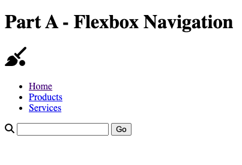
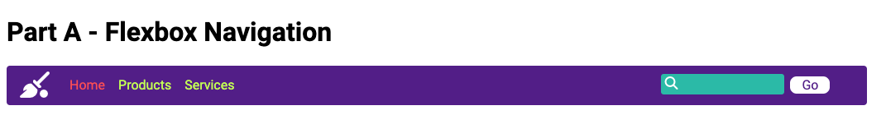
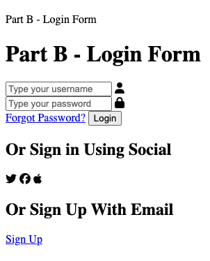

# COIS 2430H Assignment 2

### Question 1


#### Question Two - Part A UnStyled


### Question Two Part A Styled


### Code 
``` html 
<!DOCTYPE html>
<html lang="en">
  <head>
    <meta charset="UTF-8" />
    <meta http-equiv="X-UA-Compatible" content="IE=edge" />
    <meta name="viewport" content="width=device-width, initial-scale=1.0" />
    <link rel="stylesheet" href="./styles/main.css" />
    <title>Assignment 2 Part A</title>
    <script
      src="https://kit.fontawesome.com/b64131f3cf.js"
      crossorigin="anonymous"
    ></script>
  </head>
  <body>
    <header>
      <h1>Part A - Flexbox Navigation</h1>
      <div class="navbar">
        <div class="broomball">
          <h1><i class="fa-solid fa-broom-ball" title="Broomball"></i></h1></div>
        <ul class="links">
          <a href="http://127.0.0.1:5500/Assignment2/Assignment2.3/index.html">Home</a></li>
          <a href="herp">Products</a>
          <a href="her">Services</a>
        </ul>
        <div class="inputbox">
        <div class="searchicon">
          <i class="fa-solid fa-search"></i></div>
        <input type="text" placeholder=""/>
        <button type="submit">Go</button></div>
      </div>
        </section> 
    </header>
  </body>
</html>
```
### CSS
``` css
@import url('https://fonts.googleapis.com/css2?family=Poppins:wght@500&family=Roboto:ital,wght@0,100;0,300;0,400;0,500;0,700;0,900;1,100;1,300;1,400;1,500;1,700;1,900&display=swap');

* {
    font-family: "Roboto", sans-serif;
    font-weight: 700;
    font-style: normal;
}

.navbar {
    display: flex;
    align-items: center;
    width: 65em;
    height: 3em;
    background-color: rebeccapurple; 
    border: none;
    border-radius: 0.25em;
  }

  .navbar .links {
    display: flex;
    align-self: center;
    gap: 2rem;
  }

.navbar .inputbox {
 position: relative;
 top: -0.5em;
 left: 3em;
align-items: center;
padding-left: 45%;
  }
.inputbox i {
  position: absolute;
  align-items: center;
  left: 29.5em;
  top: 1em;
  font-size: 1em;
}
  a:visited {
color:#ff6666
  }
  a:link {
    font-weight: 400;
    font-size: 1em;
    text-decoration: none;
    margin-left: -1em;
    color: #ccff66
  }
  a:hover {
color: white;
  }

.navbar .broomball {
  margin-left: 1em;
    color: white;
}

.navbar .searchicon {
    color: white;
}


a:link 
{
color: #ccff66;;
}
a:visited {
color: #ff6666;
}
a:hover {
    color: pink;
}


[type=text] {
background-color: #2ec4b6;
height: 1.75em;
border-style: none;
border-radius: 0.25em;
margin-top: 1em;
  }

[type=submit] {
position: absolute;
top: 1em;
left: 39em;
background-color: white;
font-weight: 400;
font-size: 1em;
border-style: none;
width: 3em;
border-radius: 0.5em;
color:rebeccapurple;
  }
```
### Question 2 Part B - Unstyled


### Question 2 Part B - Styled
